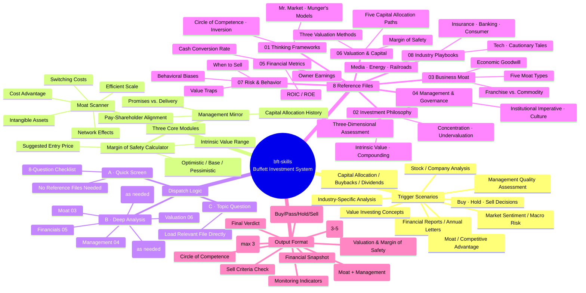

> **[中文版本 →](README.zh.md)**

# bft-skills

A collection of Claude Code skills built around Warren Buffett's investment framework.

## Skills

### `buffett` — Buffett Investment Thinking System

Activates Warren Buffett's complete investment thinking system. Covers the full workflow from quick screening to deep analysis, with structured output and industry-specific playbooks.

**Triggers automatically when you:**
- Analyze any stock or company
- Evaluate an investment opportunity
- Read financial reports, annual letters, or shareholder letters
- Judge a company's moat or competitive advantage
- Assess management quality and integrity
- Make buy / hold / sell decisions
- Discuss value investing concepts (compounding, intrinsic value, margin of safety, circle of competence, Mr. Market)
- Analyze specific industries (insurance, banking, consumer, media, energy, railroads, tech)
- Handle capital allocation, buybacks, or dividends
- Assess market sentiment or macro risk

No need to mention "Buffett" — any investment analysis or business quality question triggers the skill.

## Installation

Clone this repository into your project's `.claude/skills/` directory:

```bash
cd your-project
mkdir -p .claude/skills
git clone https://github.com/agi-now/buffett-skills .claude/skills/buffett-skills
```

Or copy individual skill directories manually:

```
your-project/
└── .claude/
    └── skills/
        └── buffett/          ← copy this folder
            ├── SKILL.md
            └── references/
                ├── 01-thinking-frameworks.md
                ├── 02-investment-philosophy.md
                ├── 03-business-moat.md
                ├── 04-management-governance.md
                ├── 05-financial-metrics.md
                ├── 06-valuation-capital.md
                ├── 07-risk-behavior.md
                └── 08-industry-playbooks.md
```

Claude Code auto-discovers skills placed under `.claude/skills/<name>/SKILL.md` — no registration required.

## Skill Structure

The `buffett` skill uses **progressive disclosure**: `SKILL.md` is always loaded, and the 8 reference files are read on-demand based on the analysis type.

### Dispatch Logic

| Path | When | Files Read |
|------|------|-----------|
| **A · Quick screen** | "Is this worth analyzing?" | None — uses the 8-question checklist |
| **B · Deep analysis** | Full company evaluation | `03→04→05→06`, plus `08` (industry) and `07` (risk) as needed |
| **C · Topic question** | Specific concept or decision | Directly loads the relevant reference file |

### Reference Files

| File | Content |
|------|---------|
| `01-thinking-frameworks.md` | Circle of competence, inversion, Mr. Market, long-term thinking, Munger's mental models |
| `02-investment-philosophy.md` | Intrinsic value, compounding, undervaluation, concentration, EMH rebuttal |
| `03-business-moat.md` | Five moat types, franchise vs. commodity business, economic goodwill |
| `04-management-governance.md` | Three-dimensional management assessment, institutional imperative, corporate culture |
| `05-financial-metrics.md` | Owner earnings, ROIC/ROE, cash conversion rate, look-through earnings |
| `06-valuation-capital.md` | Three valuation methods, margin of safety, five capital allocation paths |
| `07-risk-behavior.md` | When to sell, value traps, leverage, inflation, derivatives, behavioral biases |
| `08-industry-playbooks.md` | Insurance, banking, consumer, media, energy, railroads, tech, cautionary tales |

### Output Format

Every analysis follows a structured template with all sections required:

- **Conclusion** — Buy / Don't buy / Watch / Hold / Sell + one-sentence rationale
- **Circle of Competence** — In circle / Out of circle / Boundary
- **Key Assumptions** — 3–5 core assumptions the decision depends on
- **Business Quality** — Moat type + strength + trend, management assessment
- **Financial Snapshot** — ROIC, cash conversion rate, owner earnings estimate
- **Valuation** — Intrinsic value range, margin of safety %, suggested entry price
- **Sell Criteria Check** — Four sell criteria checked individually (required for hold/sell questions)
- **Key Risks** — Top 3 risks only
- **Monitoring Indicators** — Quarterly checks and sell triggers
- **Final Verdict** — Decision and rationale in Buffett's voice

## Eval Results

Benchmarked across 3 test cases (Apple stock analysis, banking framework, Moutai hold/sell):

| Metric | with skill | without skill | Delta |
|--------|-----------|---------------|-------|
| Pass rate | **100%** (15/15) | 66.7% (10/15) | **+33%** |
| Avg tokens | 43,353 | 12,524 | +30,829 |
| Avg time | 154.4s | 95.2s | +59.2s |

The skill's primary value is systematic reference file reading (11+ tool calls vs 2) and strict output format adherence. The token/time cost is the tradeoff for analytical depth.

## Mind Map



## Source Material

Reference files were compiled from 49 concept pages in the Buffett Letters corpus, covering every major topic from Buffett's shareholder letters and public writings.
